<div align="center">
    <div>
        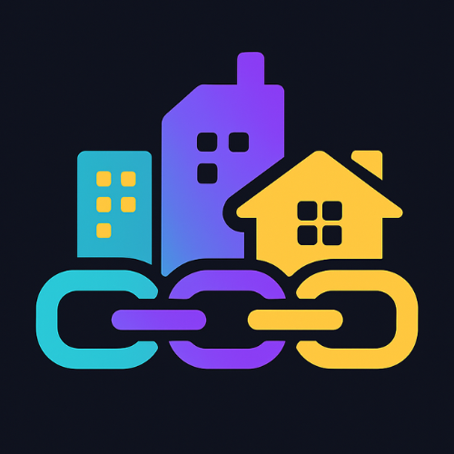
    </div>
    <div>
            <h3><b>Overworked</b></h3>
            <p><i>A digital on-chain city for creators, thinkers, and workers — powered by ICP Web3.</i></p>
    </div>      
</div>
<br>
<h1 align="center">Overworked - World Computer Hacker League Hackathon</h1>
<div align="center">

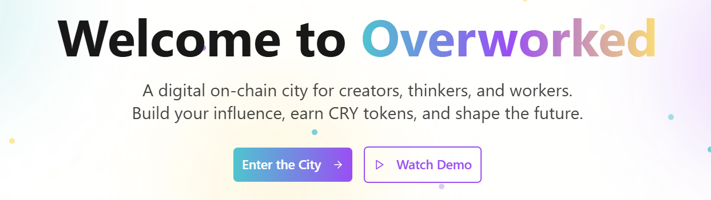

</div>
<br>
Overworked is an immersive fully on-chain Web3 City where users work, compete, learn, and earn. Set in a fully interactive digital city, users can become citizens, explore districts like TownTalk, GrindArena, WorldBrain, and WorkBay, etc to earn CRY Tokens for everything they do. From freelancing gigs to competing in arena challenges or publishing learning content.

---

## 📃 Table of Contents

- [Complete Documentation](#-complete-documentation)
- [Technology Stack](#-technology-stack)
- [Core Features](#-core-features)
- [Packages](#-packages)
- [Getting Started Locally](#-getting-started-locally)
- [env Configuration](#-env-configuration)
- [Website Preview](#-website-preview)
- [Diagram](#-diagram)
- [Owner](#-owner)
- [Contact](#-contact)

---

## 📚 Complete Documentation

<ul>
    <li><b>Notion Documentation (Full Details)</b></li>
    <a href="https://stanley-n-wijaya.notion.site/Overworked-Documentation-23c73555b71f8066af13e983aeb3be97?source=copy_link">Overworked Notion Documentation</a>
    <li><b>Canva Pitch Deck</b></li>
    <a href="https://www.canva.com/design/DAGsv18glFc/BDekibb6sh6llHZsUsC60Q/edit?utm_content=DAGsv18glFc&utm_campaign=designshare&utm_medium=link2&utm_source=sharebutton">Canva Pitch Deck</a>
    <li><b>YouTube Demo Video</b></li>
    <a href="https://youtu.be/B7ezEsK2zAE">YouTube Demo Video</a>
</ul>

---

## ⚙️ Technology Stack

<div align="center">

<kbd></kbd>
<kbd></kbd>
<kbd></kbd>
<kbd></kbd>
<kbd></kbd>
<kbd></kbd>
<kbd>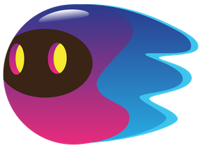</kbd>
<kbd></kbd>
<kbd></kbd>

</div>

<div align="center">
<h4>React | Vite | TypeScript | Tailwind CSS | Shadcn UI | Rust | Motoko | OpenAI | Python | Flask</h4>
</div>

---

## 🧩 Core Features

### 🏙 Overville City

**Overville** is 3d city map of Overworked to visualize that Overworked is a real city!

- 3D navigation between modules

### 🪙 CRY Token

**CRY** is an on-chain token (cryptocurrency) belonging to the Overworked ecosystem, which:

- Is used as a **medium of exchange** (for rewards, marketplaces, etc.)
- Can be **owned, sent, exchanged**, or **converted to real money**
- Has a limited supply (can be fixed or inflationary)
- Is governed by a smart contract and distributed by a **Governance DAO** (coming soon in the National WCHL Phase)

### 🧠 WorldBrain (Learn & Earn)

- Curated Web3, AI, and productivity courses
- Token rewards after course completion
- Quizzes, discussions, and creator uploads

### 🗣 TownTalk (Social Interaction)

- Post ideas, short videos, and thoughts (like Twitter/TikTok)
- Like, reply, favorite, and comment
- Trend-based discussion channels

### ⚔️ GrindArena (Competition)

- Compete in hackathons, essays, content creation, and community events
- Ranking system for richest citizen (based on CRY tokens)
- Token-based prize pools

### 💼 WorkBay (Freelance Gigs) - (Soon Full Integration)

- Post and find tasks (design, writing, tech)
- Escrow-based gig system with CRY
- Ratings and profile verification

---

## 📦 Packages

- Git
  - https://git-scm.com/book/en/v2/Getting-Started-Installing-Git
- WSL
  - powershell > type in "wsl --install"
- Visual Studio Code https://code.visualstudio.com/ With the extensions :
  - Motoko Language
    - https://marketplace.visualstudio.com/items?itemName=dfinity-foundation.vscode-motoko
  - Remote WSL
    - https://marketplace.visualstudio.com/items?itemName=ms-vscode-remote.remote-wsl
- Plug Connect
  - Extension
    - https://plugwallet.ooo/
  - Psychedelic packages
    - https://github.com/Psychedelic/plug-connect?tab=readme-ov-file

Make sure to have dfx installed, update if needed.

- DFX Version : 0.19.0

Also, make sure node is installed too.

- Node Version : 20

For more details, you can check the installation docs here:
<br>
https://docs.google.com/document/d/e/2PACX-1vTNicu-xuf4EiLAehHIqgfpjAnPjzqMGT-xpZVvYaAWNyvzYK_Ceve_me4PVRIxpzH7ea5PAX9NxGwY/pub

---

## 🧰 Getting Started Locally

### Prerequisites

- **Node.js** (v18+)
- **WSL**
- **Git**
- **Python 3.10+ (for Flask AI Server)**
- **DFX_VERSION='0.28.0'**

### Clone the Project

```
git clone https://github.com/Unchainers/Overworked.git
cd Overworked

npm i
dfx start --clean --background
dfx deps pull
dfx deps init
dfx canister create --all
dfx deps deploy
dfx deploy
npm run start

```

---

## 🔐 .env Configuration

.env for the Client Side Service

```
VITE_SUPABASE_URL=
VITE_SUPABASE_ANON_KEY=
```

---

## 📸 &nbsp;Unchainers and Overworked Logo Preview

<table style="width:100%; text-align:center">
    <col width="100%">
    <tr>
        <td width="1%" align="center">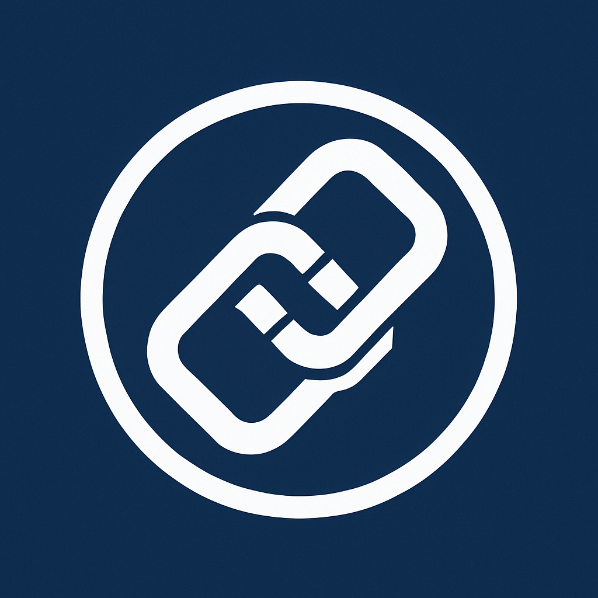</td>
    </tr>
    <tr>
        <td width="1%" align="center">Unchainers Team Logo</td>
    </tr>
    <tr>
        <td width="1%" align="center"></td>
    </tr>
    <tr>
        <td width="1%" align="center">Overworked Logo</td>
    </tr>
    <tr>
        <td width="1%" align="center">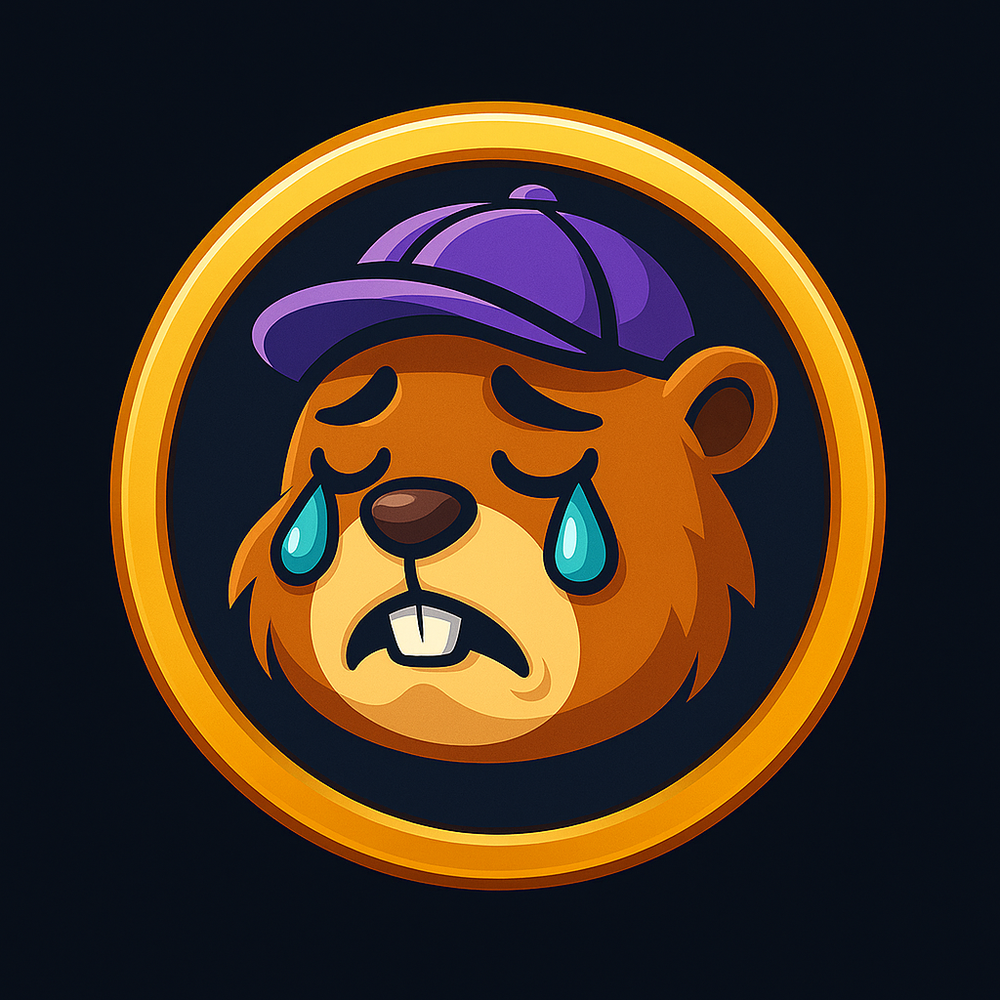</td>
    </tr>
    <tr>
        <td width="1%" align="center">CRY Token Logo</td>
    </tr>
    <tr>
        <td width="1%" align="center">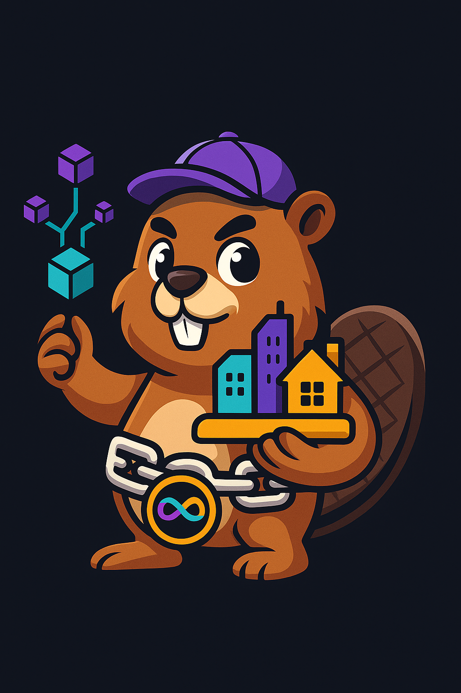</td>
    </tr>
    <tr>
        <td width="1%" align="center">Overworked Mascot (Brix)</td>
    </tr>
</table>

---

## 📸 &nbsp;Website Preview

<table style="width:100%; text-align:center">
    <col width="100%">
    <tr>
        <td width="1%" align="center">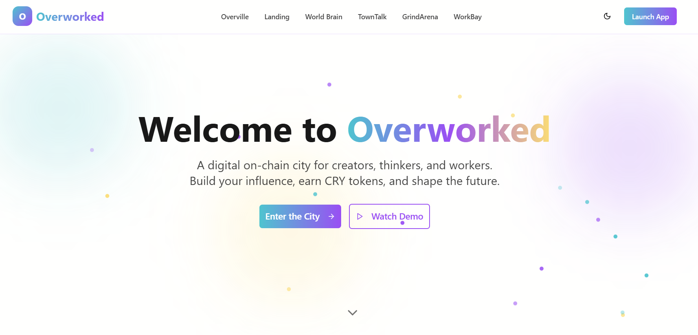</td>
    </tr>
    <tr>
        <td width="1%" align="center">Landing Page</td>
    </tr>
    <tr>
        <td width="1%" align="center">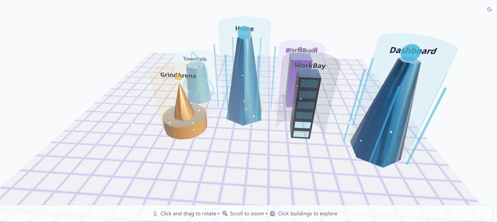</td>
    </tr>
    <tr>
        <td width="1%" align="center">Overville City Page</td>
    </tr>
    <tr>
        <td width="1%" align="center">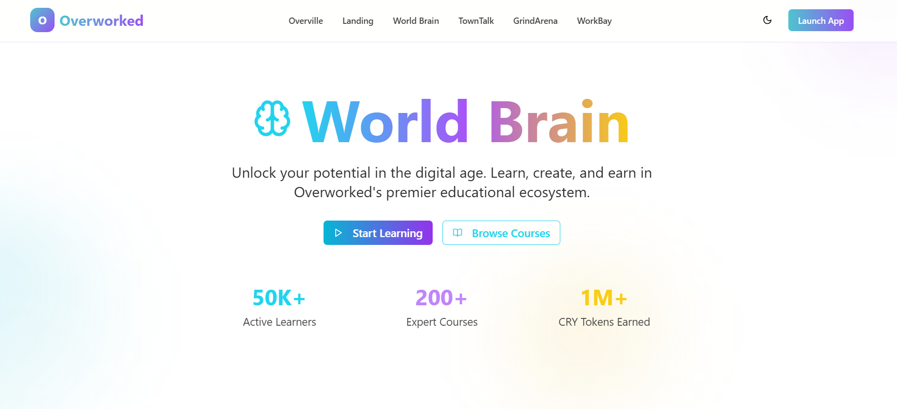</td>
    </tr>
    <tr>
        <td width="1%" align="center">World Brain Page</td>
    </tr>
    <tr>
        <td width="1%" align="center">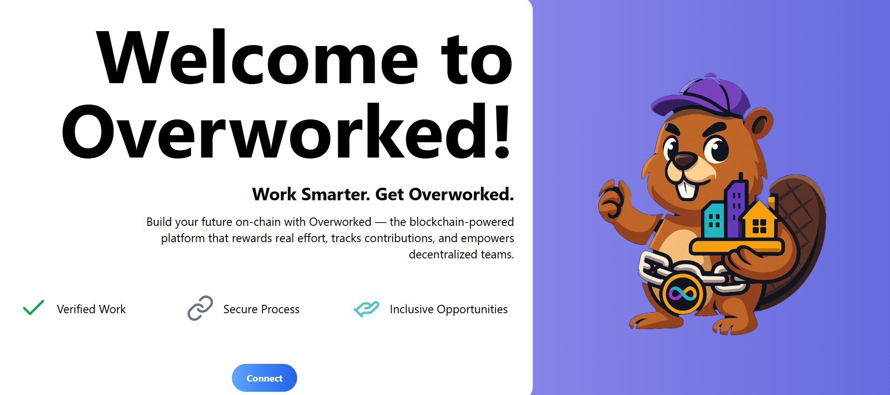</td>
    </tr>
    <tr>
        <td width="1%" align="center">Connect Wallet Page</td>
    </tr>
    <tr>
        <td width="1%" align="center">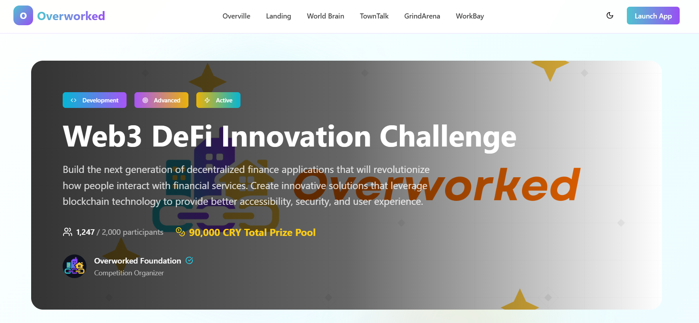</td>
    </tr>
    <tr>
        <td width="1%" align="center">Grind Arena Detail Page</td>
    </tr>
    <tr>
        <td width="1%" align="center">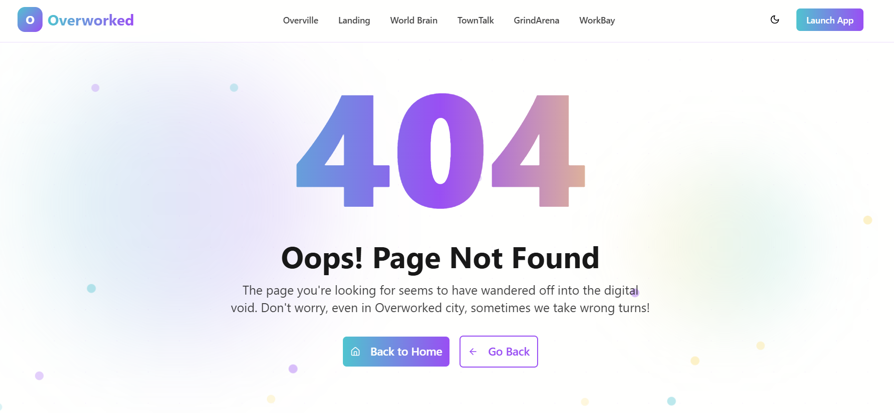</td>
    </tr>
    <tr>
        <td width="1%" align="center">Error 404 Page</td>
    </tr>
</table>

---

## 👥 Owner

This Repository is created by

<ul>
<li>Stanley Nathanael Wijaya - Team Lead and Front Dev</li>
<li>Nathaniel Alexander - ICP Engineer</li>
<li>Stanley Jonathan Wahjudi - ICP Engineer</li>
<li>Colin Oliver - ICP Engineer</li>
<li>Jason Melvin Hartono - ICP Engineer</li>
</ul>
As Hackathon Project for World Computer Hacker League 2025

---

## 📚 Acknowledgement (Attachment)

You can see the following documentation for Internet Computer online:

- [Quick Start](https://internetcomputer.org/docs/current/developer-docs/setup/deploy-locally)
- [SDK Developer Tools](https://internetcomputer.org/docs/current/developer-docs/setup/install)
- [Motoko Programming Language Guide](https://internetcomputer.org/docs/current/motoko/main/motoko)
- [Motoko Language Quick Reference](https://internetcomputer.org/docs/current/motoko/main/language-manual)
  [ICP Ninja](https://icp.ninja/)
  [Motoko Vibe Coding Template](https://github.com/pt-icp-hub/IC-Vibe-Coding-Template-Motoko)
  [Rust Vibe Coding Template](https://github.com/pt-icp-hub/IC-Vibe-Coding-Template-Rust)

---

## 📧 Contact

If any questions occured, or in the need of any discussion or details,
please contact us :

- Email : stanley.n.wijaya7@gmail.com
- Telegram : https://t.me/xstynwx
- Discord : stynw7

<code>Made with ❤️ by Unchainers Team 🔥</code>
