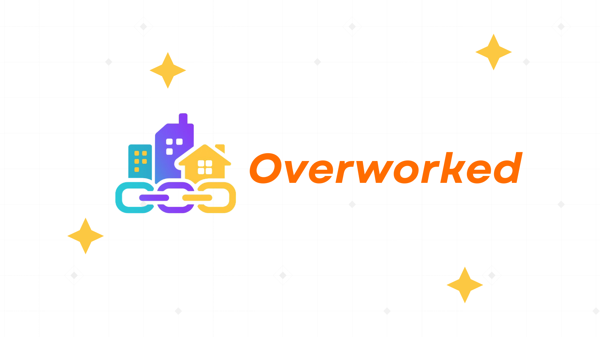

<div align="center">
    <div>
        
    </div>
    <div>
            <h3><b>Overworked</b></h3>
            <p><i>A digital on-chain city for creators, thinkers, and workers — powered by ICP Web3.</i></p>
    </div>      
</div>
<br>
<h1 align="center">Overworked - World Computer Hacker League Hackathon</h1>
<div align="center">



</div>
<br>
Overworked is an immersive fully on-chain Web3 City where users work, compete, learn, and earn. Set in a fully interactive digital city, users can become citizens, explore districts like TownTalk, GrindArena, WorldBrain, and WorkBay, etc to earn CRY Tokens for everything they do. From freelancing gigs to competing in arena challenges or publishing learning content.

---

## 📃 Table of Contents
- [Complete Documentation](#-complete-documentation)
- [Technology Stack](#-technology-stack)
- [Core Features](#-core-features)
- [Getting Started Locally](#-getting-started-locally)
- [env Configuration](#-env-configuration)
- [Website Preview](#-website-preview)
- [Diagram](#-diagram)
- [Owner](#-owner)
- [Contact](#-contact)

---

## 📚 Complete Documentation

<ul>
    <li><b>Notion Documentation (Full Details)</b></li>
    <a href="https://stanley-n-wijaya.notion.site/Overworked-Documentation-23c73555b71f8066af13e983aeb3be97?source=copy_link">Overworked Notion Documentation</a>
    <li><b>Canva Pitch Deck</b></li>
    <a href="https://www.canva.com/design/DAGsv18glFc/BDekibb6sh6llHZsUsC60Q/edit?utm_content=DAGsv18glFc&utm_campaign=designshare&utm_medium=link2&utm_source=sharebutton">Canva Pitch Deck</a>
    <li><b>YouTube Demo Video</b></li>
    <a href="https://youtu.be/B7ezEsK2zAE">YouTube Demo Video</a>
</ul>

---

## ⚙️ Technology Stack

<div align="center">

<kbd></kbd>
<kbd></kbd>
<kbd></kbd>
<kbd></kbd>
<kbd></kbd>
<kbd></kbd>
<kbd></kbd>
<kbd></kbd>
<kbd></kbd>

</div>

<div align="center">
<h4>React | Vite | TypeScript | Tailwind CSS | Shadcn UI | Rust | Motoko | OpenAI | Python | Flask</h4>
</div>

---

## 🧩 Core Features

### 🏙 OpenCity Dashboard

- 3D navigation between modules

### 🧠 WorldBrain (Learn & Earn)

- Curated Web3, AI, and productivity courses
- Token rewards after course completion
- Quizzes, discussions, and creator uploads

### 🗣 TownTalk (Social Interaction)

- Post ideas, short videos, and thoughts (like Twitter/TikTok)
- Like, reply, favorite, and comment
- Trend-based discussion channels

### ⚔️ GrindArena (Competition)

- Compete in hackathons, essays, content creation, and community events
- Ranking system for richest citizen (based on CRY tokens)
- Token-based prize pools

### 💼 WorkBay (Freelance Gigs) - (Soon Full Integration)

- Post and find tasks (design, writing, tech)
- Escrow-based gig system with CRY
- Ratings and profile verification

---

## 🧰 Getting Started Locally

### Prerequisites
- **Node.js** (v16+)
- **Supabase Account**
- **Cloudinary Account**
- **Git**
- **Python 3.10+ (for Flask AI Server)**

### Clone the Project
```
git clone https://github.com/StyNW7/Elysium.git
cd elysium
cd Client
npm install
npm run dev
```

---

## 🔐 .env Configuration

.env for the Client Side Service
```
VITE_SUPABASE_URL=
VITE_SUPABASE_ANON_KEY=
```

---

## 📸 &nbsp;Website Preview
<table style="width:100%; text-align:center">
    <col width="100%">
    <tr>
        <td width="1%" align="center"></td>
    </tr>
    <tr>
        <td width="1%" align="center">Home Page</td>
    </tr>
    <tr>
        <td width="1%" align="center"></td>
    </tr>
    <tr>
        <td width="1%" align="center">Realms Page</td>
    </tr>
    <tr>
        <td width="1%" align="center"></td>
    </tr>
    <tr>
        <td width="1%" align="center">Content Detail Page</td>
    </tr>
    <tr>
        <td width="1%" align="center"></td>
    </tr>
    <tr>
        <td width="1%" align="center">Explore Page</td>
    </tr>
    <tr>
        <td width="1%" align="center"></td>
    </tr>
    <tr>
        <td width="1%" align="center">Remix Studio Page</td>
    </tr>
    <tr>
        <td width="1%" align="center"></td>
    </tr>
    <tr>
        <td width="1%" align="center">Aether Page</td>
    </tr>
    <tr>
        <td width="1%" align="center"></td>
    </tr>
    <tr>
        <td width="1%" align="center">Elysian's Dashboard Page</td>
    </tr>
</table>

---

## 🧭 Diagram

*Overall Database System Flow:*
<p align="center">
  
</p>

This diagram shows how the models connected using ERD Diagram

---

## 👥 Owner

This Repository is created by
<ul>
<li>Stanley Nathanael Wijaya</li>
</ul>
As Hackathon Project for United Hacks V5

---

## 📬 Contact
Have questions or want to collaborate?

- 📧 Email: stanley.n.wijaya7@gmail.com
- 💬 Discord: `stynw7`

<code>Made with ❤️ by SNW with only 1.5 days</code>