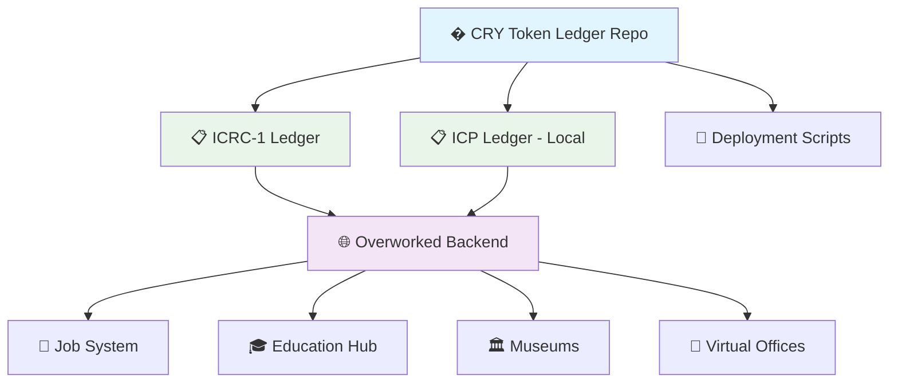

<div align="center">

# 💎 CRY Token Ledger
### *ICRC-1 Token Infrastructure for the Overworked Metaverse*

[](https://opensource.org/licenses/MIT)
[](https://internetcomputer.org/)
[](https://github.com/dfinity/ICRC-1)
[](https://github.com/dfinity/ICRC-1/tree/main/standards/ICRC-2)
[](https://github.com/dfinity/sdk)

**🌐 Part of the [Overworked Metaverse](https://github.com/Unchainers/Overworked) ecosystem**

*Foundational token infrastructure for virtual economies* 💼✨

</div>

---

## 🎯 Overview

This repository contains the **ICRC-1 ledger deployment infrastructure** for the **CRY Token** - the native cryptocurrency of the [Overworked Metaverse](https://github.com/Unchainers/Overworked). 

The CRY Token powers a revolutionary virtual world where users earn real value through:

- 💼 **Job Marketplace** - Get paid in CRY for completing virtual tasks
- 🎓 **Education Hubs** - Earn tokens while learning new skills
- 🏛️ **Museums & Culture** - Monetize cultural experiences and content creation
- 🏢 **Virtual Offices** - Facilitate real business operations in the metaverse
- 🛍️ **Marketplace** - Trade virtual assets and services

> **📝 Note**: The main token logic and smart contracts are implemented in the [Overworked Metaverse backend](https://github.com/Unchainers/Overworked). This repository focuses solely on ledger deployment and configuration.

## ✨ What This Repository Provides

### 🏗️ **Ledger Infrastructure**
- **ICRC-1 Ledger Deployment** - Standard-compliant token ledger
- **ICP Ledger Integration** - Local development with ICP compatibility
- **NNS Setup** - Network Nervous System for testing environments

### 🛠️ **Deployment Automation**
- **One-command deployment** - Automated setup scripts
- **Environment management** - Configurable for different networks
- **Account management** - Automated minter and controller setup

### ⚡ **Standards Compliance**
- **ICRC-1** compatible for seamless integration
- **ICRC-2** support for advanced token operations
- **Cross-ledger compatibility** with other IC tokens

## 🏗️ Architecture



## 🚀 Quick Start

### 📋 Prerequisites

- **dfx** `>= 0.27.0`
- **WSL2** (for Windows users)
- **Git**

### 🛠️ Installation

```bash
# Clone the repository
git clone https://github.com/Unchainers/CRY-Token.git
cd CRY-Token

# Install dfx if not already installed
sh -ci "$(curl -fsSL https://sdk.dfinity.org/install.sh)"

# Setup environment variables
cp .bash.env.template .bash.env
# Edit .bash.env with your configuration
```

### 🌐 Local Development

```bash
# Start local replica
dfx start --background

# Deploy with temporary accounts (development only)
./deploy_ledger.bash --temp-acc

# Deploy with specific owners
./deploy_ledger.bash --set-owners <ICP_OWNER> <CRY_OWNER>

# Deploy using current identity
./deploy_ledger.bash --with-redeem
```

### � Configuration Options

| Option | Description | Usage |
|--------|-------------|--------|
| `--temp-acc` | 🧪 Create temporary test accounts | Development only |
| `--set-owners` | 👥 Set specific owner principals | `--set-owners <icp> <cry>` |
| `--with-redeem` | 🔑 Use current identity as owner | Single command setup |

## 📊 Deployed Canisters

After successful deployment, you'll have:

### 🪙 **ICRC-1 Ledger Canister**
- **Purpose**: Main CRY token ledger
- **Standard**: ICRC-1/ICRC-2 compliant
- **Functions**: Transfer, balance queries, allowances
- **Integration**: Used by Overworked backend

### 💰 **ICP Ledger Canister** (Local only)
- **Purpose**: Local ICP simulation for testing
- **Standard**: ICP ledger compatible
- **Functions**: ICP transfers and balance management
- **Usage**: Development and testing only

## 💰 Token Configuration

| Parameter | Value | Description |
|-----------|-------|-------------|
| **Symbol** | `CRY` | Token ticker symbol |
| **Name** | `CRY Token` | Full token name |
| **Decimals** | `8` | Precision (like Bitcoin) |
| **Supply** | `1,000,000` | Initial pre-minted tokens |
| **Transfer Fee** | `0` | No fees for basic transfers |

## 🌟 Integration with Overworked

### 🔗 **How It Connects**
The ledger deployed by this repository is consumed by the main [Overworked Metaverse](https://github.com/Unchainers/Overworked) backend for:

- **🏪 Token Vending Machine** - ICP to CRY exchange
- **🔄 P2P Token Swaps** - User-to-user trading
- **💼 Job Payments** - Automated salary distribution
- **🎓 Education Rewards** - Learning incentives
- **🛍️ Marketplace Transactions** - Virtual asset trading

### 📋 **Environment Variables**
After deployment, these variables are available for the main project:

```bash
# Auto-generated in .env file
CANISTER_ID_ICRC1_LEDGER_CANISTER=<ledger-canister-id>
CANISTER_ID_ICP_LEDGER_CANISTER=<icp-canister-id>
DFX_NETWORK=local
```

## 🔗 Usage Examples

### **Get Canister IDs**
```bash
# Check deployed canister IDs
dfx canister id icrc1_ledger_canister
dfx canister id icp_ledger_canister
```

### **Check Token Balance**
```bash
# Use the balance checker utility
./wheretoken.bash

# Or manually query
dfx canister call icrc1_ledger_canister icrc1_balance_of '(record { owner = principal "user-principal-here" })'
```

### **Integration in Main Project**
```motoko
// In Overworked backend - reference the deployed ledger
let cryLedger : ICRC1.Service = actor("canister-id-from-env");

// Use the ledger for transfers
let result = await cryLedger.icrc1_transfer({
    to = { owner = userPrincipal; subaccount = null };
    amount = rewardAmount;
    fee = null;
    memo = null;
    created_at_time = null;
});
```

## 📁 Project Structure

```
CRY-Token/
├── 📄 README.md                    # This file
├── ⚙️ dfx.json                     # DFX configuration for ledgers
├── 🔧 deploy_ledger.bash           # Main deployment script
├── 📊 .bash.env.template           # Environment template
├── 📊 .bash.env                    # Your environment config
├── 🗂️ src/
│   └── 📋 declarations/            # Generated type definitions
├── 📜 setup.txt                    # Troubleshooting guide
├── 🔍 wheretoken.bash              # Balance checking utility
└── 📝 *.log                        # Deployment logs
```

## 🧪 Testing & Utilities

### 🔍 **Check Balances Across All Identities**
```bash
# Run the balance checker
./wheretoken.bash
```

### 🎯 **Test Token Operations**
```bash
# Check total supply
dfx canister call icrc1_ledger_canister icrc1_total_supply

# Check token metadata
dfx canister call icrc1_ledger_canister icrc1_metadata
```

### 📊 **Monitor Deployment**
```bash
# Check deployment logs
tail -f nns_install.log
tail -f bishop.log
```

## 🚀 Deployment

### 🏠 **Local Testing**
```bash
# Use local replica
export DFX_NETWORK=local
./deploy_ledger.bash --temp-acc
```

## ⚠️ Important Notes

### � **Security Considerations**
- Never use `--temp-acc` for mainnet deployment
- Keep your principal keys secure
- Use proper identity management for production

### �️ **Development Workflow**
1. Deploy ledger infrastructure (this repo)
2. Copy canister IDs to main project
3. Integrate with Overworked backend
4. Test end-to-end functionality

### 📝 **Troubleshooting**
Common issues and solutions are documented in [`setup.txt`](setup.txt)

## 🤝 Contributing

We welcome contributions to the CRY Token ledger infrastructure!

### 🛠️ **Development Workflow**
1. 🍴 Fork the repository
2. 🌿 Create a feature branch (`git checkout -b feature/ledger-improvement`)
3. ✍️ Commit your changes (`git commit -m 'Improve ledger deployment'`)
4. 📤 Push to the branch (`git push origin feature/ledger-improvement`)
5. � Open a Pull Request

### 📝 **Code Standards**
- Follow bash scripting best practices
- Test deployment scripts thoroughly
- Document environment variable changes
- Use meaningful commit messages

## 📞 Support & Community

- 🐛 **Issues**: [GitHub Issues](https://github.com/Unchainers/CRY-Token/issues)
- 💬 **Discussions**: [GitHub Discussions](https://github.com/Unchainers/CRY-Token/discussions)
- 🌐 **Main Project**: [Overworked Metaverse](https://github.com/Unchainers/Overworked)

## 🙏 Acknowledgments

- 🏗️ **Internet Computer Foundation** - For the incredible ICP infrastructure
- 🔧 **DFINITY** - For the ICRC standards and development tools
- 🌟 **IC Community** - For continuous support and feedback

